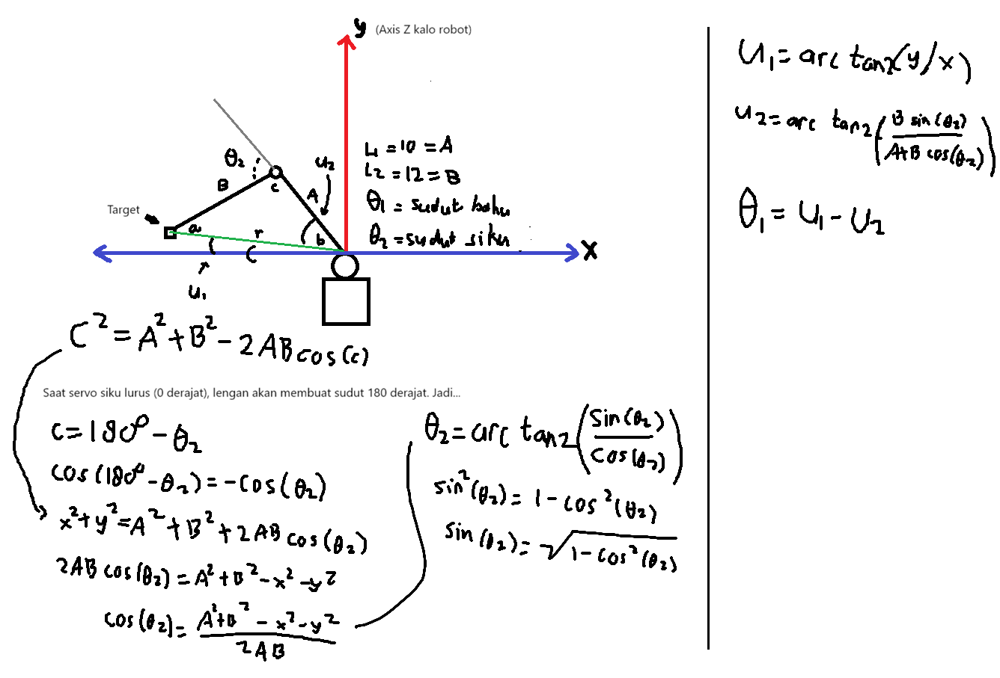

# Penjelasan Inverse Kinematics Lengan 🦾

Bagian ini khusus menjelaskan bagaimana algoritma robot mengubah perintah koordinat target ujung jari `(x, y)` menjadi derajat putaran motor servo pada engsel bahu ($\theta_1$) dan siku ($\theta_2$). 

Agar lebih mudah dibayangkan, berikut adalah skema geometri dan rumus matematis yang digunakan di dalam kode program:

## Cara Kerja Algoritma

Algoritma di dalam file `ArmInverse.cpp` menggunakan pendekatan trigonometri (Aturan Kosinus) untuk menyelesaikan masalah lengan 2-DOF (*Degrees of Freedom*) Planar. Perhitungannya dibagi menjadi dua tahap utama:

### 1. Menghitung Sudut Siku / *Elbow* ($\theta_2$)
Sudut tekukan siku harus dihitung terlebih dahulu dengan memanfaatkan Aturan Kosinus pada segitiga yang dibentuk oleh: pangkal bahu, engsel siku, dan titik koordinat target ujung jari.

* **Jarak ke Target:** Pertama, program mencari nilai kuadrat dari jarak garis lurus dari pangkal bahu langsung ke titik target ($x^2 + y^2$).
* **Aturan Kosinus:** Memanfaatkan panjang fisik lengan atas ($A$ atau $L_1$) dan lengan bawah ($B$ atau $L_2$), nilai tersebut dimasukkan ke dalam Aturan Kosinus: $C^2 = A^2 + B^2 - 2AB \cos(c)$.
* **Kompensasi Nol Derajat Servo:** Secara mekanis perangkat keras, saat servo siku berada di posisi $0^\circ$, lengan akan lurus merentang (membentuk sudut dalam $180^\circ$ pada segitiga). Oleh karena itu, dilakukan substitusi trigonometri $\cos(180^\circ - \theta_2) = -\cos(\theta_2)$ yang menghasilkan rumus aljabar akhir untuk mencari nilai kosinus siku.
* **Konversi ke Derajat:** Nilai kosinus tersebut kemudian diubah menjadi sudut radian (lalu dikonversi ke derajat) menggunakan identitas sinus $\sin(\theta_2) = \sqrt{1 - \cos^2(\theta_2)}$ dan fungsi `atan2()`.

### 2. Menghitung Sudut Bahu / *Shoulder* ($\theta_1$)
Pencarian sudut bahu membutuhkan kalkulasi kompensasi atau simpangan, karena posisi ujung jari tidak lagi berada sejajar dengan tulang lengan atas saat siku sedang ditekuk.

* **Sudut Elevasi Target ($U_1$):** Menghitung sudut kemiringan garis lurus imajiner yang ditarik dari pangkal bahu langsung menembak ke titik target `(x, y)` menggunakan rumus `atan2(y, x)`.
* **Sudut Simpangan Siku ($U_2$):** Karena siku ditekuk sebesar $\theta_2$, ujung jari bergeser dari sumbu utama lengan atas. Program menghitung seberapa besar simpangan sudut bayangan ini menggunakan letak lokal ujung jari ($B \sin(\theta_2)$ untuk posisi vertikal dan $A + B \cos(\theta_2)$ untuk posisi horizontal).
* **Sudut Akhir Bahu ($\theta_1$):** Sudut putaran servo bahu didapatkan dengan mengurangkan sudut elevasi target ($U_1$) dengan sudut simpangan akibat tekukan siku ($U_2$). 

Melalui dua perhitungan berurutan di atas, ujung capit lengan robot akan selalu terkalibrasi dan mendarat akurat di koordinat yang diperintahkan.